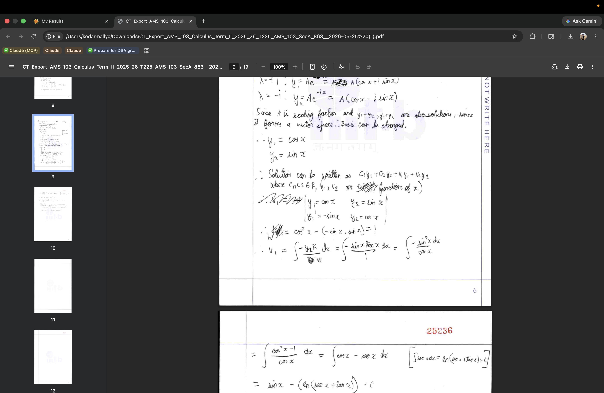

# CodeTantra Answer Script Exporter

A Chrome extension that seamlessly exports your CodeTantra exam results into a consolidated, LLM-ready PDF document. 

It takes the scattered data on the CodeTantra results page—including your submitted answer script, the question text/images, and evaluator comments—and packages them into a clean, continuously flowing PDF.

## Features

- **One-Click Export**: Extracts exam data directly from the page context without requiring manual copying or screenshots.
- **Smart Formatting**: Compiles questions, images, and evaluator comments into a dense, continuously flowing layout to minimize wasted space. 
- **Answer Script Merging**: Automatically appends your originally uploaded answer script PDF to the end of the document.
- **LLM-Ready**: Designed specifically to create a unified PDF that can be attached to ChatGPT, Claude, or Gemini for easy analysis of your performance and mistakes.
- **S3 Pre-fetching**: Bypasses CORS restrictions by downloading answer script resources from AWS S3 using the page's native browser context.
- **Native macOS UI**: The extension popup is styled with a clean Apple-like aesthetic and includes a Light/Dark mode toggle that persists in local storage.

## Supported Browsers

This extension is built using Manifest V3 and works on:
- **Chromium-based browsers** (Google Chrome, Microsoft Edge, Brave, Arc, Opera, Vivaldi)
- **Mozilla Firefox** (version 128 and above — required for `scripting.executeScript` with `world: 'MAIN'`)

## Installation

Since this is a developer extension, you'll need to load it manually from the source code.

### For Chromium Browsers (Chrome, Edge, Brave, Arc, etc.)
1. Clone or download this repository to your local machine.
2. Open your browser and navigate to the extensions page (e.g., `chrome://extensions/`, `edge://extensions/`, or `brave://extensions/`).
3. Enable **Developer mode** (usually a toggle in the top right or bottom left corner).
4. Click the **Load unpacked** button.
5. Select the `extension/` folder from the directory where you saved this project.
6. The icon should now appear in your browser extensions toolbar!

### For Mozilla Firefox
1. Clone or download this repository to your local machine.
2. Open Firefox and navigate to `about:debugging#/runtime/this-firefox`.
3. Click on the **Load Temporary Add-on...** button.
4. Select the `manifest.json` file inside the `extension/` folder.
5. The extension will be loaded temporarily (until you restart Firefox).

## Usage

1. Open your **CodeTantra Exam Results** page. 
   *(Note: You must be on the page where it shows the list of questions, your score, and the "Evaluator Comments" boxes).*
2. **Important**: The signed S3 URLs for your images and PDF expire shortly after the page loads (usually ~15 minutes). For best results, **refresh the results page** immediately before exporting.
3. Click on the Answer Script Exporter extension icon in your toolbar.
4. Verify your Exam Name and Student ID in the popup panel.

5. Click **Export PDF**. 
6. Wait for the progress bar to finish processing. The resulting PDF will automatically download to your computer.

## How it Works

- **Extraction (`popup.js`)**: Injects a script into the `MAIN` world of the CodeTantra page to securely read the global `window.testSummary` object and parse the DOM for evaluator comments.
- **PDF Generation (`background.js`)**: Acts as a Service Worker that receives the parsed data, fetches remote AWS S3 images, and uses `pdf-lib` to stitch a brand-new PDF together in a Background thread.
- **Encoding Fixes**: Custom sanitization logic (`toWinAnsi`) ensures that the `pdf-lib` WinAnsi standard font handles emojis, newlines, and smart quotes without crashing.

## License
MIT License. Feel free to fork and modify for your own university's specific implementation of CodeTantra.
